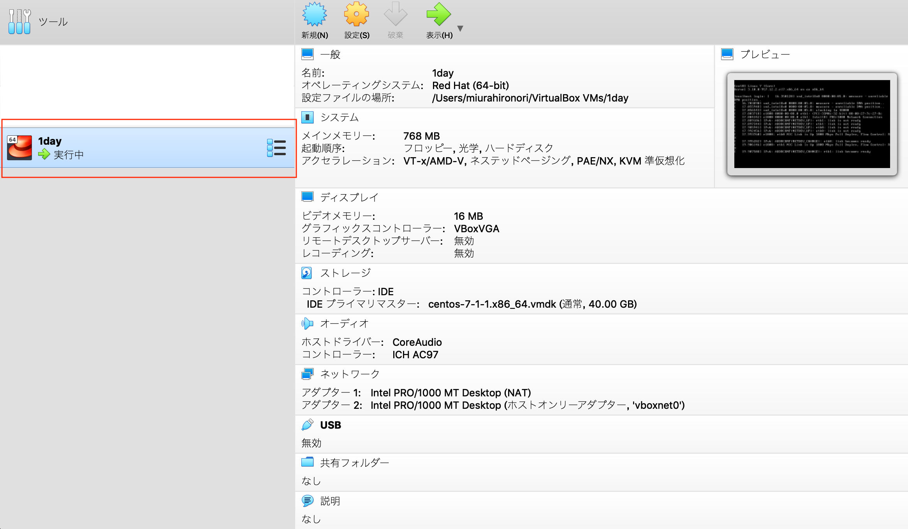

# Step1
このStepではVagrant、VirtualBoxを用いて仮装環境を構築します


## ハンズオン用ディレクトリの作成
HOST OS上の任意のディレクトリで`1day`ディレクトリを作成し、遷移しましょう。以降`1day`ディレクトリをカレントディレクトリとします。

```
$ mkdir 1day
$ cd 1day
```

## Vagrant設定ファイル(Vagrantfile)の作成
`Vagrantfile`が作成されること

```
$ vagrant init
$ ls -la
-rw-r--r--   1 miurahironori  staff  3008  9  7 17:24 Vagrantfile
```

## boxファイルの配布
インターネットからDLするとそれなりのサイズのため、ネットワーク環境に不安がある場合に限り、事前に渡したUSBの中にある　`centos/7`ディレクトリを指定したディレクトリにコピーしましょう

`~/.vagrant.d/boxes` ボックスファイルが格納されるディレクトリ    
`vagrant box list` ローカルで利用可能なボックスのリスト表示。今回`centos/7           (virtualbox, 1905.1)`が初回に表示されないこと    

```
$ vagrant box list

$ cp -R /Volumes/NO\ NAME/centos-VAGRANTSLASH-7 ~/.vagrant.d/boxes/.
$ vagrant box list
centos/7           (virtualbox, 1905.1)
```

## Vagrantfile編集
カレントディレクトリで`Vagrantfile`を以下の内容で編集しましょう

|設定項目|設定値|
|:-|:-|
|boxファイル|puppetlabs/centos-7.2-64-nocm|
|IPアドレス|192.168.56.50|
|VirtualBoxマシン名|1day|
|メモリ|768M|

`vi Vagrantfile`以降の内容をペースト

```
$ vi Vagrantfile
# -*- mode: ruby -*-
# vi: set ft=ruby :

Vagrant.configure("2") do |config|
  config.vm.box = "centos/7"
  config.vm.hostname = "1day.local"
  config.vm.network :private_network, ip: "192.168.56.50"
  config.vm.provider :virtualbox do |vb|
    vb.name = "1day"
    vb.customize ["modifyvm", :id, "--memory", "768"]
  end
end
```

## Vagrantによる仮想環境の起動(初回の作成)
`not created (virtualbox)`から`running (virtualbox)`となること

```
$ vagrant status
Current machine states:

default                   not created (virtualbox)

$ vagrant up

$ vagrant status
Current machine states:

default                   running (virtualbox)
```

## ssh-configの確認
今回のVagrant環境に接続する際の設定を確認する

```
$ vagrant ssh-config
Host default
  HostName 127.0.0.1
  User vagrant
  Port 2222
  UserKnownHostsFile /dev/null
  StrictHostKeyChecking no
  PasswordAuthentication no
  IdentityFile /Users/miurahironori/Vagrant/1day/.vagrant/machines/default/virtualbox/private_key
  IdentitiesOnly yes
  LogLevel FATAL
```
## VirtualBoxでの確認
VirtualBoxのGUIコンソールで`1day`と言う仮想サーバが存在し「実行中」となっていることを確認する



## 接続とrootユーザ遷移
`vagrant ssh`にて仮想環境に`vagrant`ユーザでログインし`root`まで遷移できることを確認する

**注 以降`#`でのコマンドは`root`で行う**

```
$ vagrant ssh
Last login: Wed Sep  4 07:39:34 2019 from 192.168.56.1

$ who
vagrant  pts/0        Sep  4 07:40 (10.0.2.2)
```

rootに遷移

```
$ sudo su -
# who -H
NAME     LINE         TIME             COMMENT
vagrant  pts/0        2019-09-07 00:53 (10.0.2.2)
#
```

**whoコマンドについて調べてみましょう**

## 設定内容の確認
NICの確認IPアドレスが`Vagrantfile`で設定したIP`192.168.56.50`が設定されていること。

```
# ip a
1: lo: <LOOPBACK,UP,LOWER_UP> mtu 65536 qdisc noqueue state UNKNOWN
    link/loopback 00:00:00:00:00:00 brd 00:00:00:00:00:00
    inet 127.0.0.1/8 scope host lo
       valid_lft forever preferred_lft forever
    inet6 ::1/128 scope host
       valid_lft forever preferred_lft forever
2: enp0s3: <BROADCAST,MULTICAST,UP,LOWER_UP> mtu 1500 qdisc pfifo_fast state UP qlen 1000
    link/ether 08:00:27:b7:f3:af brd ff:ff:ff:ff:ff:ff
    inet 10.0.2.15/24 brd 10.0.2.255 scope global dynamic enp0s3
       valid_lft 63945sec preferred_lft 63945sec
    inet6 fe80::a00:27ff:feb7:f3af/64 scope link
       valid_lft forever preferred_lft forever
3: enp0s8: <BROADCAST,MULTICAST,UP,LOWER_UP> mtu 1500 qdisc pfifo_fast state UP qlen 1000
    link/ether 08:00:27:27:cb:87 brd ff:ff:ff:ff:ff:ff
    inet 192.168.56.50/24 brd 192.168.56.255 scope global enp0s8
       valid_lft forever preferred_lft forever
    inet6 fe80::a00:27ff:fe27:cb87/64 scope link
       valid_lft forever preferred_lft forever
```

デフォルトゲートウェイの確認

```
# ip r
default via 10.0.2.2 dev eth0 proto dhcp metric 100
10.0.2.0/24 dev eth0 proto kernel scope link src 10.0.2.15 metric 100
192.168.56.0/24 dev eth1 proto kernel scope link src 192.168.56.50 metric 101
```

`resolv.conf`の確認

```
# cat /etc/resolv.conf
# Generated by NetworkManager
search local
nameserver 10.0.2.3
```

メモリの確認 `Mem:        758812`にて約768M確保されていること

```
# free
              total        used        free      shared  buff/cache   available
Mem:         758812       89916      534236        5324      134660      549976
Swap:       1048572           0     1048572
```

同様にメモリの確認

```
# cat /proc/meminfo
MemTotal:         758812 kB
MemFree:          534236 kB
MemAvailable:     549996 kB
Buffers:             948 kB
Cached:           105660 kB
SwapCached:            0 kB
Active:           101816 kB
Inactive:          68732 kB
Active(anon):      64092 kB
Inactive(anon):     5172 kB
Active(file):      37724 kB
Inactive(file):    63560 kB
Unevictable:           0 kB
Mlocked:               0 kB
SwapTotal:       1048572 kB
SwapFree:        1048572 kB
Dirty:                 0 kB
Writeback:             0 kB
AnonPages:         63972 kB
Mapped:            22472 kB
Shmem:              5324 kB
Slab:              28072 kB
SReclaimable:      16904 kB
SUnreclaim:        11168 kB
KernelStack:        1840 kB
PageTables:         4380 kB
NFS_Unstable:          0 kB
Bounce:                0 kB
WritebackTmp:          0 kB
CommitLimit:     1427976 kB
Committed_AS:     333512 kB
VmallocTotal:   34359738367 kB
VmallocUsed:        9856 kB
VmallocChunk:   34359719420 kB
HardwareCorrupted:     0 kB
AnonHugePages:      4096 kB
HugePages_Total:       0
HugePages_Free:        0
HugePages_Rsvd:        0
HugePages_Surp:        0
Hugepagesize:       2048 kB
DirectMap4k:       51136 kB
DirectMap2M:      735232 kB
```

## Question
サーバスペックの視点でCPU数、Disk容量、その他について確認してみましょう

## ssh接続
`vagrant ssh`をsshコマンドで実行

```
$ ssh -i /vagrant ssh-configで調べた鍵を指定 -o StrictHostKeyChecking=no vagrant@192.168.56.50
Last login: Wed Sep  4 07:40:16 2019 from 10.0.2.2

$ who
vagrant  pts/0        Sep  4 07:46 (192.168.56.1)
$ exit
logout
Connection to 192.168.56.50 closed.
```

## ファイル共有
デフォルトではHOST-GUEST間でファイルが共有できないため`vagrant-vbguest`の機能を使いHOST-GUEST間のファイル共有を実現しましょう

HOST OSからVagrantfileが存在するカレントディレクトリにてshare.txtを作成し、GUEST OSから参照できることを確認

ディレクトリ確認
```
$ pwd
/xxxxxxx/1day
```

ファイル作成

```
$ vi share.txt
$ cat share.txt
share
$ vagrant ssh
$ cd /vagrant
$ ll
ファイルが存在しないことを確認
```

`vagrant-vbguest`のインストール

```
$ vagrant plugin list
No plugins installed.

$ vagrant plugin install vagrant-vbguest
Installing the 'vagrant-vbguest' plugin. This can take a few minutes...
Fetching: micromachine-3.0.0.gem (100%)
Fetching: vagrant-vbguest-0.19.0.gem (100%)
Installed the plugin 'vagrant-vbguest (0.19.0)'!

$ vagrant plugin list
vagrant-vbguest (0.19.0, global)
```

Vagrantfileに以下のように`config.vm.synced_folder ".", "/vagrant", type: "virtualbox"`を追記しましょう

```
$ vi Vagrantfile
$ cat Vagrantfile
# -*- mode: ruby -*-
# vi: set ft=ruby :

Vagrant.configure("2") do |config|
  config.vm.box = "centos/7"
  config.vm.synced_folder ".", "/vagrant", type: "virtualbox"
  config.vm.hostname = "1day.local"
  config.vm.network :private_network, ip: "192.168.56.50"
  config.vm.provider :virtualbox do |vb|
    vb.name = "1day"
    vb.customize ["modifyvm", :id, "--memory", "768"]
  end
end
```

vagrantの削除から起動(5分ほど掛かります)

```
$ vagrant destroy

$ vagrant up
```

ファイル共有の確認

```
$ vi share.txt
$ cat share.txt
share

$ vagrant ssh

$ cd /vagrant
$ ll
total 8
-rw-r--r--. 1 vagrant vagrant 388  9月  4 08:12 Vagrantfile
-rw-r--r--. 1 vagrant vagrant   6  9月  4 08:16 share.txt

$ cat share.txt
share
```

## ロケールとタイムゾーンの設定
boxで設定されたLANG en_US.UTF-8、タイムゾーンUTCをja_JP.utf8、JSTに変更する

ロケールの指定

```
# localectl
   System Locale: LANG=en_US.UTF-8
       VC Keymap: us
      X11 Layout: n/a

# localectl set-locale LANG=ja_JP.utf8

# localectl
   System Locale: LANG=ja_JP.utf8
       VC Keymap: us
      X11 Layout: n/a
# vi /etc/locale.conf
LANG="ja_JP.utf8"
```

タイムゾーンJSTの指定

```
# timedatectl
      Local time: Sat 2019-09-07 10:13:22 JST
  Universal time: Sat 2019-09-07 01:13:22 UTC
        RTC time: Sat 2019-09-07 01:13:21
       Time zone: UTC (JST, +0900)
     NTP enabled: yes
NTP synchronized: yes
 RTC in local TZ: no
      DST active: n/a

# timedatectl set-timezone Asia/Tokyo

# timedatectl
      Local time: Sat 2019-09-07 10:13:33 JST
  Universal time: Sat 2019-09-07 01:13:33 UTC
        RTC time: Sat 2019-09-07 01:13:32
       Time zone: Asia/Tokyo (JST, +0900)
     NTP enabled: yes
NTP synchronized: yes
 RTC in local TZ: no
      DST active: n/a
```

## エディタのインストール
今後作業する上で使い慣れたエディタが良い人は必須ではありませんがインストールを行いましょう

- vim
```
# yum install -y vim
```

- emacs
```
# yum install -y emacs
```

## Tips
### 仮想環境の再構築、pluginの削除

```
$ vagrant destroy

$ vagrant plugin list
$ vagrant plugin uninstall vagrant-vbguest

$ vagrant plugin list
No plugins installed.
```

```
$ vi Vagrantfile
- config.vm.synced_folder ".", "/vagrant", type: "virtualbox"

$ vagrant up
$ vagrant ssh
$ sudo su -
```

### Vagrant基本操作

起動
```
$ vagrant up
```

停止
```
$vagrant halt
```

削除
```
$ vagrant destroy
```

これでStep1は完了です

