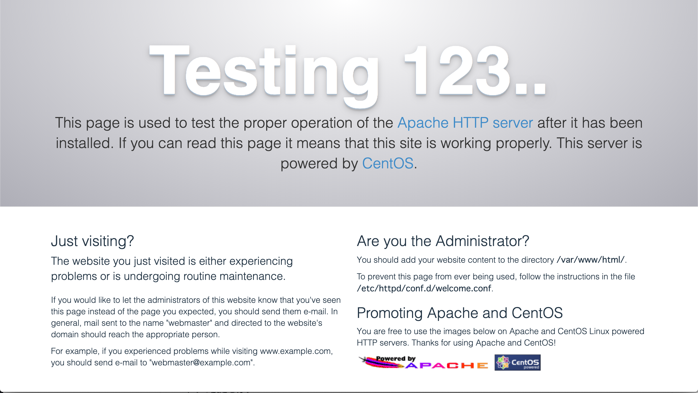
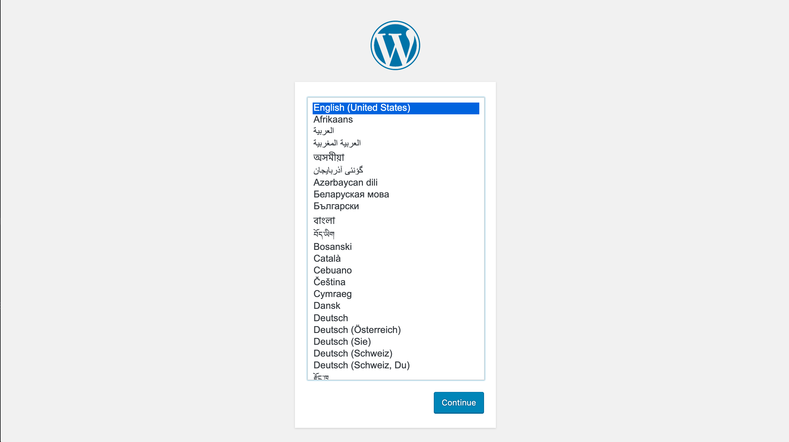
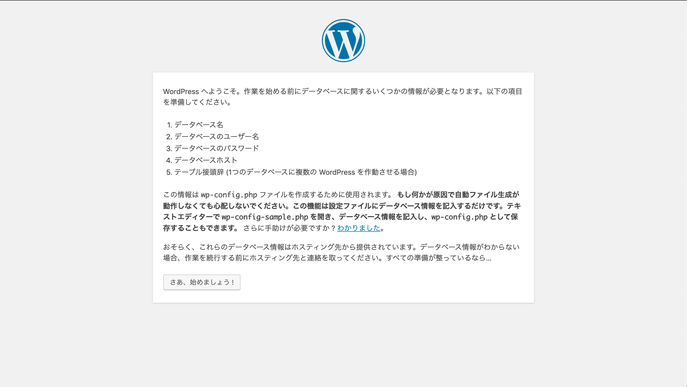
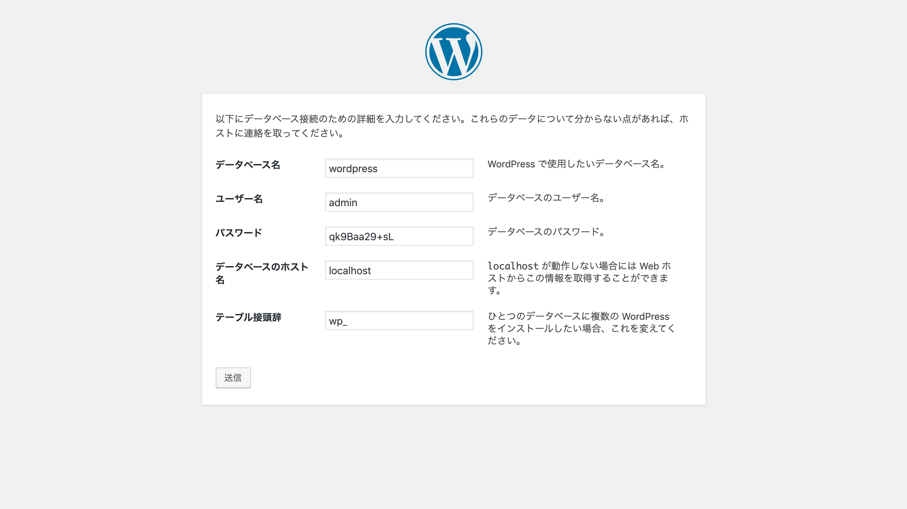
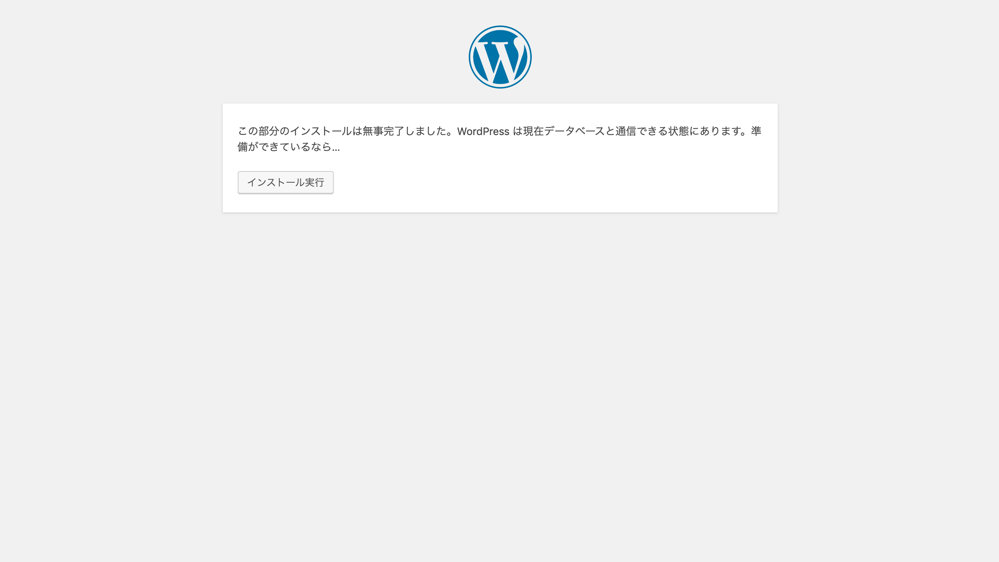
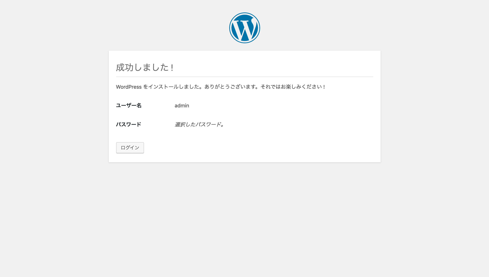
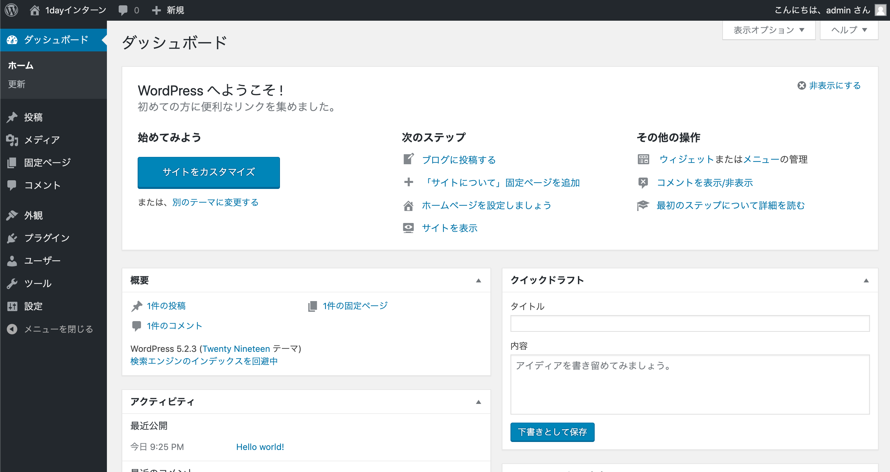

# Step2
このStepではStep1で作成した仮装環境をLAMP環境にカスタマイズしていきます。

## LAMP環境の構築
Step1で構築した環境にapache、php、mysqlをインストールしLAMP環境を構築します

## yum repo
これから各種ミドルウェア(apache、MySQL）やPHPをインストールする際に利用するリポジトリの設定を行う

**`/etc/yum.repos.d/`ディレクトリと内容について簡単に確認**

```
# ll /etc/yum.repos.d/
total 44
-rw-r--r--. 1 root root  731 Aug 14  2019 CentOS-AppStream.repo
-rw-r--r--. 1 root root  712 Aug 14  2019 CentOS-Base.repo
-rw-r--r--. 1 root root  798 Aug 14  2019 CentOS-centosplus.repo
-rw-r--r--. 1 root root 1320 Aug 14  2019 CentOS-CR.repo
-rw-r--r--. 1 root root  668 Aug 14  2019 CentOS-Debuginfo.repo
-rw-r--r--. 1 root root  756 Aug 14  2019 CentOS-Extras.repo
-rw-r--r--. 1 root root  338 Aug 14  2019 CentOS-fasttrack.repo
-rw-r--r--. 1 root root  928 Aug 14  2019 CentOS-Media.repo
-rw-r--r--. 1 root root  736 Aug 14  2019 CentOS-PowerTools.repo
-rw-r--r--. 1 root root 1382 Aug 14  2019 CentOS-Sources.repo
-rw-r--r--. 1 root root   74 Aug 14  2019 CentOS-Vault.repo

# cat /etc/yum.repos.d/CentOS-Base.repo

# CentOS-Base.repo
#
# The mirror system uses the connecting IP address of the client and the
# update status of each mirror to pick mirrors that are updated to and
# geographically close to the client.  You should use this for CentOS updates
# unless you are manually picking other mirrors.
#
# If the mirrorlist= does not work for you, as a fall back you can try the
# remarked out baseurl= line instead.
#
#

[base]
name=CentOS-$releasever - Base
mirrorlist=http://mirrorlist.centos.org/?release=$releasever&arch=$basearch&repo=os&infra=$infra
#baseurl=http://mirror.centos.org/centos/$releasever/os/$basearch/
gpgcheck=1
gpgkey=file:///etc/pki/rpm-gpg/RPM-GPG-KEY-CentOS-7

#released updates
[updates]
name=CentOS-$releasever - Updates
mirrorlist=http://mirrorlist.centos.org/?release=$releasever&arch=$basearch&repo=updates&infra=$infra
#baseurl=http://mirror.centos.org/centos/$releasever/updates/$basearch/
gpgcheck=1
gpgkey=file:///etc/pki/rpm-gpg/RPM-GPG-KEY-CentOS-7

#additional packages that may be useful
[extras]
name=CentOS-$releasever - Extras
mirrorlist=http://mirrorlist.centos.org/?release=$releasever&arch=$basearch&repo=extras&infra=$infra
#baseurl=http://mirror.centos.org/centos/$releasever/extras/$basearch/
gpgcheck=1
gpgkey=file:///etc/pki/rpm-gpg/RPM-GPG-KEY-CentOS-7

#additional packages that extend functionality of existing packages
[centosplus]
name=CentOS-$releasever - Plus
mirrorlist=http://mirrorlist.centos.org/?release=$releasever&arch=$basearch&repo=centosplus&infra=$infra
#baseurl=http://mirror.centos.org/centos/$releasever/centosplus/$basearch/
gpgcheck=1
enabled=0
gpgkey=file:///etc/pki/rpm-gpg/RPM-GPG-KEY-CentOS-7
```

### epel
epelのインストール(注 `yum -y update`は数分ほど掛かる)

```
# dnf -y install epel-release
# dnf -y update
```

### remi
remiのインストール

```
# dnf -y install http://rpms.famillecollet.com/enterprise/remi-release-8.rpm
# dnf -y update
```

**`/etc/yum.repos.d/`ディレクトリと内容について簡単に確認**

```
# ll /etc/yum.repos.d/
total 84
-rw-r--r--. 1 root root  731 Sep 16 05:10 CentOS-AppStream.repo
-rw-r--r--. 1 root root  712 Sep 16 05:10 CentOS-Base.repo
-rw-r--r--. 1 root root  798 Sep 16 05:10 CentOS-centosplus.repo
-rw-r--r--. 1 root root 1043 Sep 16 05:10 CentOS-CR.repo
-rw-r--r--. 1 root root  668 Sep 16 05:10 CentOS-Debuginfo.repo
-rw-r--r--. 1 root root  743 Sep 16 05:10 CentOS-Devel.repo
-rw-r--r--. 1 root root  756 Sep 16 05:10 CentOS-Extras.repo
-rw-r--r--. 1 root root  338 Sep 16 05:10 CentOS-fasttrack.repo
-rw-r--r--. 1 root root  738 Sep 16 05:10 CentOS-HA.repo
-rw-r--r--. 1 root root  928 Sep 16 05:10 CentOS-Media.repo
-rw-r--r--. 1 root root  736 Sep 16 05:10 CentOS-PowerTools.repo
-rw-r--r--. 1 root root 1382 Sep 16 05:10 CentOS-Sources.repo
-rw-r--r--. 1 root root   74 Sep 16 05:10 CentOS-Vault.repo
-rw-r--r--. 1 root root 1167 Dec 19  2019 epel-modular.repo
-rw-r--r--. 1 root root 1249 Dec 19  2019 epel-playground.repo
-rw-r--r--. 1 root root 1104 Dec 19  2019 epel.repo
-rw-r--r--. 1 root root 1266 Dec 19  2019 epel-testing-modular.repo
-rw-r--r--. 1 root root 1203 Dec 19  2019 epel-testing.repo
-rw-r--r--. 1 root root  903 Feb 27  2020 remi-modular.repo
-rw-r--r--. 1 root root 1384 Feb 27  2020 remi.repo
-rw-r--r--. 1 root root  778 Feb 27  2020 remi-safe.repo
```

dnfコマンドでも確認

```
# dnf repolist
repo id                              repo name
AppStream                            CentOS-8 - AppStream
BaseOS                               CentOS-8 - Base
epel                                 Extra Packages for Enterprise Linux 8 - x86_64
epel-modular                         Extra Packages for Enterprise Linux Modular 8 - x86_64
extras                               CentOS-8 - Extras
remi-modular                         Remi's Modular repository for Enterprise Linux 8 - x86_64
remi-safe                            Safe Remi's RPM repository for Enterprise Linux 8 - x86_64
```

### Question
dnf、yum、RPMについて調べてみましょう

## PHP7、apache(httpd)
PHP7、apache(httpd)のインストールを行う

```
# dnf -y module disable php
# dnf module install -y php:remi-7.3
dnf
# dnf -y install --enablerepo=remi,remi-php73 php php-devel php-mbstring php-pdo php-gd php-xml php-mcrypt php-mysql
```

PHPのバージョンを確認(PHP 7.XX.XXであること)

```
# php -v
PHP 7.3.23 (cli) (built: Sep 29 2020 08:33:03) ( NTS )
Copyright (c) 1997-2018 The PHP Group
Zend Engine v3.3.23, Copyright (c) 1998-2018 Zend Technologies
```
### apacheのインストール
```
# dnf install -y httpd
```

### apache起動、自動起動
apache(httpd)の起動、自動起動の設定を行う

apache(httpd)がインストールされていることを確認
```
# dnf list installed | grep httpd
centos-logos-httpd.noarch                   80.5-2.el8                                 @BaseOS
httpd.x86_64                                2.4.37-21.module_el8.2.0+494+1df74eae      @AppStream
httpd-filesystem.noarch                     2.4.37-21.module_el8.2.0+494+1df74eae      @AppStream
httpd-tools.x86_64                          2.4.37-21.module_el8.2.0+494+1df74eae      @AppStream
```
起動
```
# systemctl start httpd.service
```
自動起動設定
```
# systemctl enable httpd.service
```
確認(runningであること)
```
# systemctl status httpd.service
```
確認(enabledであること)
```
# systemctl is-enabled httpd.service
```

localhostに対しhttpリクエストを投げWebサーバ(httpd)が動作していることを確認

```
# curl localhost
```
### Question
`curl`コマンドでレスポンスヘッダも表示させましょう

**ブラウザでも同様に192.168.56.50で確認する**



### lsof
apache(httpd)がPORT80番をLISTENしているか確認するため`lsof`をインストール

```
# dnf -y install lsof
```

確認

```
# lsof -i:80
COMMAND  PID   USER   FD   TYPE DEVICE SIZE/OFF NODE NAME
httpd    734   root    4u  IPv6  16183      0t0  TCP *:http (LISTEN)
httpd    769 apache    4u  IPv6  16183      0t0  TCP *:http (LISTEN)
httpd    770 apache    4u  IPv6  16183      0t0  TCP *:http (LISTEN)
httpd    771 apache    4u  IPv6  16183      0t0  TCP *:http (LISTEN)
httpd    772 apache    4u  IPv6  16183      0t0  TCP *:http (LISTEN)
httpd    773 apache    4u  IPv6  16183      0t0  TCP *:http (LISTEN)
httpd   3007 apache    4u  IPv6  16183      0t0  TCP *:http (LISTEN)
```

### viの設定
`~/.virc`に追記する
```
# vi ~/.virc
# cat ~/.virc
set encoding=utf-8
set fileencodings=iso-2022-jp,euc-jp,sjis,utf-8
set fileformats=unix,dos,mac
```
### Question
`/var/www/html/`配下に以下のindex.phpを配置しブラウザ、CLI`curl localhost`で確認してみましょう

```
<?php
echo "hello PHP<br>";
echo date('Y年m月d日 H時i分s秒');
```
curlで確認
```
# curl localhost
```

### Question
PHPのBuiltinWebServerの機能を使いPORT 8888番でindex.phpを表示してみましょう(CTL + cで停止)

**注 SELinuxが有効なため現時点では別ターミナルから`curl localhost`のみ表示できます**

```
# cd /var/www/html
# php -S localhost:8888
```

### PHP設定変更
php.iniのタイムゾーンを変更する
```
# vi /etc/php.ini
- ;date.timezone =
+ date.timezone = "Asia/Tokyo"
```
apache(httpd),php-fpm再起動
```
# systemctl restart php-fpm
# systemctl restart httpd.service
```
確認
```
# curl localhost
```


## MySQL
MySQLのインストールを行う

### mariadb削除
標準でインストールされているmariadbを削除する

確認
```
# rpm -qa | grep mariadb
mariadb-libs-5.5.60-1.el7_5.x86_64
```

存在する場合削除
```
# yum -y remove mariadb-libs
```

ディレクトリも削除
```
# rm -rf /var/lib/mysql/
```

### MySQL yumrepo

### repoのインストール
MySQL8.0をインストール

```
# dnf -y localinstall https://dev.mysql.com/get/mysql80-community-release-el8-1.noarch.rpm
```

### 確認とrepoの設定
```
# ll /etc/yum.repos.d
# dnf repolist enabled | grep "mysql.*-community.*"
```

### モジュールの抑止
```
# dnf -y  module disable mysql
```

### インストール
```
# dnf -y install mysql-community-server
```

### MySQLの起動、自動起動を設定

起動
```
# systemctl start mysqld.service
```
自動起動の設定
```
# systemctl enable mysqld.service
```
確認(runningであること)
```
# systemctl status mysqld.service
```
確認(enabledであること)
```
# systemctl is-enabled mysqld.service
```

### PORT確認
MySQLがPORT3306番をLISTENしているか確認
```
# lsof -i:3306
COMMAND   PID  USER   FD   TYPE DEVICE SIZE/OFF NODE NAME
mysqld  31699 mysql   30u  IPv6  65873      0t0  TCP *:mysql (LISTEN)
```

### rootパスワード
MySQLのrootパスワードをログから確認`A temporary password is generated for root@localhost:`の右を確認

```
# cat /var/log/mysqld.log
# grep password /var/log/mysqld.log
```

### 初期設定
`mysql_secure_installation`を実行

```
# mysql_secure_installation
```

確認したパスワードを入力

```
Enter password for user root: 
```

i1db+abd8kD

```
New password: 
```

i1db+abd8kD

```
Re-enter new password: 
```

y

```
Change the password for root ? ((Press y|Y for Yes, any other key for No) : 
```

i1db+abd8kD

```
New password:
```

i1db+abd8kD

```
Re-enter new password:
```

y

```
Do you wish to continue with the password provided?(Press y|Y for Yes, any other key for No) :
```

y

```
Remove anonymous users? (Press y|Y for Yes, any other key for No) :
```

y

```
Disallow root login remotely? (Press y|Y for Yes, any other key for No) : 
```

y

```
Remove test database and access to it? (Press y|Y for Yes, any other key for No) : 
```

y

```
Reload privilege tables now? (Press y|Y for Yes, any other key for No) : 
```

### 設定変更
MySQLの設定ファイル`my.cnf`を以下に上書きする
```
# vi /etc/my.cnf
[mysqld]
innodb-buffer-pool-size=128M
default-authentication-plugin=mysql_native_password
```

再起動
```
# systemctl restart mysqld.service
```

### ログイン
MySQLクライアントからログイン。パスワードは`mysql_secure_installation`で設定したものを入力

パスワード：i1db+abd8kD

```
# mysql -u root -p
Enter password:

mysql> show databases;
+--------------------+
| Database           |
+--------------------+
| information_schema |
| mysql              |
| performance_schema |
| sys                |
+--------------------+
4 rows in set (0.00 sec)

mysql>
```

### アプリケーション用DB作成
DB`wordpress`の作成

```
mysql> create database wordpress charset = utf8mb4;
Query OK, 1 row affected (0.07 sec)
```

作成したDBの確認

```
mysql> show databases;
+--------------------+
| Database           |
+--------------------+
| information_schema |
| mysql              |
| performance_schema |
| sys                |
| wordpress          |
+--------------------+
5 rows in set (0.04 sec)
```

DDLの確認

```
mysql> show create database wordpress;
+-----------+-------------------------------------------------------------------------------------------------------------------------------------+
| Database  | Create Database                                                                                                                     |
+-----------+-------------------------------------------------------------------------------------------------------------------------------------+
| wordpress | CREATE DATABASE `wordpress` /*!40100 DEFAULT CHARACTER SET utf8mb4 COLLATE utf8mb4_0900_ai_ci */ /*!80016 DEFAULT ENCRYPTION='N' */ |
+-----------+-------------------------------------------------------------------------------------------------------------------------------------+
1 row in set (0.00 sec)
```


### アプリケーションユーザの作成
`'admin'@'localhost'`ユーザを作成

```
mysql> create user 'admin'@'localhost' identified by 'qk9Baa29+sL';

mysql> grant all on *.* to 'admin'@'localhost';

mysql> alter user 'admin'@'localhost' identified with mysql_native_password by 'qk9Baa29+sL';

mysql> exit
```

## サンプルアプリのデプロイ

`wget`コマンドのインストール

```
# dnf -y install wget
```

今回アプリケーションをデプロイするディレクトリへ遷移
```
# cd /var/www/html
```

Wordpressを取得し`tar`で展開

```
# wget http://wordpress.org/latest.tar.gz
# tar -xzvf latest.tar.gz
```

ファイル所有者の変更

```
# chown apache:apache -R wordpress
```

SELinuxの設定

```
# chcon -R -t httpd_sys_content_t /var/www/html/wordpress
# chcon -R -t httpd_sys_rw_content_t /var/www/html/wordpress
```

### apache(httpd)の設定変更と再起動
apache(httpd)の設定ファイル`httpd.conf`でDocuemtRootとDirectoryの変更を行い再起動

```
# vi /etc/httpd/conf/httpd.conf
- DocumentRoot "/var/www/html"
+ DocumentRoot "/var/www/html/wordpress"
- <Directory "/var/www/html">
+<Directory "/var/www/html/wordpress">
```

php-mysqlのインストール
```
# dnf -y install php-mysql
```

apache(httpd)の再起動

```
# systemctl restart httpd.service
```

確認
```
# systemctl status httpd.service
```

### Qumestion
DocumentRootについて調べましょう

### WordPressを表示
**ブラウザで192.168.56.50を表示。Wordpressの設定画面が表示されれば成功**



## Wordpressの設定
日本語を選択し続けるを押下


さあ、始めましょうを押下



ユーザ：admin、パスワード：qk9Baa29+sL



インストール実行を押下



サイトのタイトル「1dayインターン」、ユーザ名：admin、パスワードはテキスト保存しましょう、メールアドレスは任意で設定、検索エンジンでの表示はチェックしWordPressをインストールを押下


ログインを押下



ユーザ名：admin、パスワードはテキスト保存したパスワードを入力しログイン


管理画面が表示されること



これでStep2は完了です。

