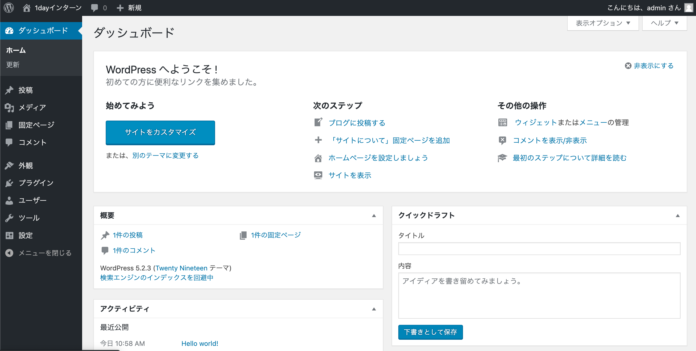
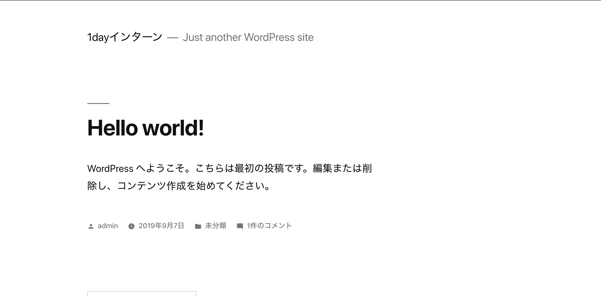

# Step3
Step2で構築したLAMP環境のMySQLをDockerコンテナに置き換えます

## Docker
MySQLをdockerで利用するため、dockerのインストール、起動を行いましょう

リポジトリの追加
```
# dnf config-manager --add-repo https://download.docker.com/linux/centos/docker-ce.repo
```

インストール
```
# dnf -y install docker-ce docker-ce-cli containerd.io
```

### 起動と自動起動の設定

起動
```
# systemctl start docker.service
```
自動起動の設定
```
# systemctl enable docker.service
```
確認(runningであること)
```
# systemctl status docker.service
```
確認(enabledであること)
```
# systemctl is-enabled docker.service
```

バージョンの確認

```
# docker version
Client: Docker Engine - Community
 Version:           19.03.13
 API version:       1.40
 Go version:        go1.13.15
 Git commit:        4484c46d9d
 Built:             Wed Sep 16 17:02:36 2020
 OS/Arch:           linux/amd64
 Experimental:      false

Server: Docker Engine - Community
 Engine:
  Version:          19.03.13
  API version:      1.40 (minimum version 1.12)
  Go version:       go1.13.15
  Git commit:       4484c46d9d
  Built:            Wed Sep 16 17:01:11 2020
  OS/Arch:          linux/amd64
  Experimental:     false
 containerd:
  Version:          1.3.7
  GitCommit:        8fba4e9a7d01810a393d5d25a3621dc101981175
 runc:
  Version:          1.0.0-rc10
  GitCommit:        dc9208a3303feef5b3839f4323d9beb36df0a9dd
 docker-init:
  Version:          0.18.0
  GitCommit:        fec3683
```

## Docker MySQL

dockerイメージの確認

```
# docker images
REPOSITORY          TAG                 IMAGE ID            CREATED             SIZE
```

MySQLのdockerイメージをpullします

```
# docker pull mysql:latest
```

dockerイメージの確認

```
# docker images
REPOSITORY          TAG                 IMAGE ID            CREATED             SIZE
docker.io/mysql     latest              62a9f311b99c        3 weeks ago         445 MB
```

### コンテナの起動と確認
MySQLイメージからMYSQL_ROOT_PASSWORD=mysqlにてパスワードを設定しコンテナを起動します。今回はポートフォワードを3307から3306で行います。docker run後docker psでコンテナが立ち上がってることを確認しましょう

確認

```
# docker ps
CONTAINER ID        IMAGE               COMMAND             CREATED             STATUS              PORTS 
```

コンテナ起動

```
# docker run --name mysqld -e MYSQL_ROOT_PASSWORD=mysql -d -p 3307:3306 mysql
```

確認(CONTAINER IDを確認)

```
# docker ps
CONTAINER ID        IMAGE               COMMAND                  CREATED             STATUS              PORTS                                         NAMES
1c0bb6af2ee4        mysql               "docker-entrypoint..."   30 seconds ago      Up 29 seconds       3306/tcp, 33060/tcp, 0.0.0.0:3307->3306/tcp   mysqld
```

### bashモードで接続
コンテナに直接接続します。docker psにて出力された**CONTAINER ID**を指定しましょう。

```
# docker exec -it 1c0bb6af2ee4 bash
```

コンテナ内でMySQLに接続します(パスワード：mysql)

```
# mysql -u root -p
Enter password:
```

存在するデータベースの確認

```
mysql> show databases;
+--------------------+
| Database           |
+--------------------+
| information_schema |
| mysql              |
| performance_schema |
| sys                |
+--------------------+
4 rows in set (0.10 sec)

mysql> exit
Bye
```

コンテナから抜けます

```
# exit
exit
```

### 仮想サーバからの接続
仮想サーバのMySQL Clientから接続(パスワード：mysql)

```
# mysql -u root -p --port=3307 -h127.0.0.1
Enter password:
```

存在するデータベースの確認

```
mysql> show databases;
+--------------------+
| Database           |
+--------------------+
| information_schema |
| mysql              |
| performance_schema |
| sys                |
+--------------------+
4 rows in set (0.10 sec)

mysql> exit
```

### Qestion
MySQLClientで接続する際に`mysql -u root -p --port=3307 -hlocalhost`で接続するために指定するオプションを調べましょう

### dockerコンテナの起動停止と削除
起動したdockerコンテナを使い起動停止と削除を行う

CONTAINER IDを確認

```
# docker ps -a
CONTAINER ID        IMAGE               COMMAND                  CREATED             STATUS              PORTS                               NAMES
4fc496c089a1        mysql               "docker-entrypoint..."   About an hour ago   Up About an hour    33060/tcp, 0.0.0.0:3307->3306/tcp   mysqld
```

停止(stop以降は実際のCONTAINER IDを指定)
```
# docker stop 4fc496c089a1
```

起動
```
# docker start 4fc496c089a1
```

停止し削除(CONTAINER IDではなくNAMESでの指定も可能)

```
# docker stop mysqld
# docker rm mysqld
```

確認

```
# docker ps -a
CONTAINER ID        IMAGE               COMMAND             CREATED             STATUS              PORTS               NAMES
```

## docker-compose

docker-composeのインストールとファイル権限変更

[docker compose公式](https://docs.docker.com/compose/install/)

```
# curl -L "https://github.com/docker/compose/releases/download/1.27.4/docker-compose-$(uname -s)-$(uname -m)" -o /usr/local/bin/docker-compose
# chmod +x /usr/local/bin/docker-compose
```

バージョンの確認

```
# docker-compose -version
docker-compose version 1.27.4, build 40524192
```

docker-compose用のディレクトリ作成と遷移

```
# cd /vagrant 
# mkdir docker_mysql
# cd docker_mysql
```

docker-compose.ymlの作成(vi以下の内容をペースト)

```
# vi docker-compose.yml
version: '3.7'
services:
  db:
    build: ./mysql/
    image: mysql:latest
    environment:
      MYSQL_DATABASE: wordpress
      MYSQL_ROOT_PASSWORD: mysql
      MYSQL_USER: admin
      MYSQL_PASSWORD: qk9Baa29+sL
    expose:
      - "3306"
    ports:
      - "3307:3306"
```

docker MySQL用のディレクトリ作成

```
# mkdir mysql
# cd mysql
```

Dockerfileの作成(vi以下をペースト)

```
# vi Dockerfile
FROM mysql:latest
ADD ./conf.d/my.cnf /etc/mysql/conf.d/my.cnf
```

MySQL設定ファイルmy.cnfの作成(vi以下をペースト)

```
# mkdir conf.d
# cd conf.d

# vi my.cnf
[mysqld]
innodb-buffer-pool-size=128M
default-authentication-plugin=mysql_native_password
```

docker-composeでbuild

```
# cd ../..
# docker-compose build
```

docker imegeの確認

```
# docker images
```

dockerコンテナの起動

```
# docker-compose up -d
```

docker MySql コンテナの確認

```
# docker ps
```

### bashモードで接続
コンテナに直接接続します。docker psにて出力された**CONTAINER ID**を指定しましょう。

```
# docker exec -it 84336a6fb964 bash
```

### MySQL接続
コンテナ内でMySQLに接続(パスワード：mysql)

```
# mysql -u root -p
Enter password:
```

存在するデータベースの確認(wordpressが存在すること)

```
mysql> show databases;
+--------------------+
| Database           |
+--------------------+
| information_schema |
| mysql              |
| performance_schema |
| sys                |
| wordpress          |
+--------------------+
5 rows in set (0.00 sec)
```

アプリケーションユーザの確認(admin % が存在すること)

```
mysql> use mysql

mysql> select user,host from user;
+------------------+-----------+
| user             | host      |
+------------------+-----------+
| admin            | %         |
| root             | %         |
| mysql.infoschema | localhost |
| mysql.session    | localhost |
| mysql.sys        | localhost |
| root             | localhost |
+------------------+-----------+
6 rows in set (0.00 sec)

mysql> exit
Bye
#
```

DBアプリケーションユーザで接続確認

パスワード：qk9Baa29+sL

```
# mysql -u admin -p -hlocalhost --protocol=tcp --port=3307

mysql> show databases;
mysql> exit
```

## データ移行
mysqldumpを使いlocalhostで動作しているMySQLのデータをdockerコンテナのMySQLへ移行する

パスワード：i1db+abd8kD

```
# cd /vagrant
# mysqldump -u root -p wordpress > export.sql
```

LocalhostのMySQLを自動起動抑止と停止

```
# systemctl disable mysqld.service
# systemctl stop mysqld.service
```

確認(Active: inactive (dead)であること)

```
# systemctl status mysqld.service
```

ブラウザでWordpressのサイトを確認しましょう


データベースのリストア

パスワード：mysql

```
# cd /vagrant
# mysql -u root -p -h127.0.0.1 --port=3307 wordpress < export.sql
Enter password:
```

### SELinuxの設定変更

```
# setsebool -P httpd_can_network_connect=1
```

### WordpressのDB接続変更

```
# vi /var/www/html/wordpress/wp-config.php

- define('DB_HOST', 'localhost');
+ define('DB_HOST', '127.0.0.1:3307');
```

ブラウザでエラーだった192.168.56.50をリロードし管理画面が表示されれば成功



## WordPressのDocker化
PORT8000番にDockerコンテナのWordPressを起動することでWordPress+MySQLをDockerで連携させる

停止と削除

```
# cd docker_mysql
# docker-compose down -v
```

Dockerイメージの削除`REPOSITORY`がmysqlの`IMAGE ID`を指定

```
# docker images
REPOSITORY          TAG                 IMAGE ID            CREATED             SIZE
mysql               latest              32ea220bd41c        7 minutes ago       445 MB
docker.io/mysql     latest              62a9f311b99c        3 weeks ago         445 MB

# docker rmi 32ea220bd41c
```

docker-compose.ymlの変更(vi以降を全て上書き)

```
# vi docker-compose.yml
version: '3.7'
services:
  db:
    build: ./mysql/
    image: mysql:latest
    environment:
      MYSQL_DATABASE: wordpress
      MYSQL_ROOT_PASSWORD: mysql
      MYSQL_USER: admin
      MYSQL_PASSWORD: qk9Baa29+sL
    expose:
      - "3306"
    ports:
      - "3307:3306"
  wordpress:
    build: ./wordpress/
    image: wordpress:latest
    expose:
      - "80"
    ports:
      - "8000:80"
    restart: always
    environment:
      WORDPRESS_DB_HOST: db
      WORDPRESS_DB_USER: admin
      WORDPRESS_DB_PASSWORD: qk9Baa29+sL
      WORDPRESS_DB_NAME: wordpress
    depends_on:
      - db
```

wordpress用のディレクトリ作成と遷移

```
# mkdir wordpress
# cd wordpress
```

Dockerfileの作成(vi以降をペースト)

```
# vi Dockerfile
FROM wordpress:latest
ENV DEBIAN_FRONTEND noninteractive

RUN apt-get update
RUN apt-get install -y locales

RUN echo "ja_JP.UTF-8 UTF-8" > /etc/locale.gen && \
    locale-gen ja_JP.UTF-8 && \
    dpkg-reconfigure locales && \
    /usr/sbin/update-locale LANG=ja_JP.UTF-8

ENV LC_ALL ja_JP.UTF-8
```

元のディレクトリへ

```
# cd ..
```

`debconf: delaying package configuration, since apt-utils is not installed`は無視して良い

```
# docker-compose build

# docker-compose up -d
```

DBのログイン確認(パスワード：mysql)

```
# mysql -u root -p -h127.0.0.1 --port=3307
```

データのリストア(パスワード：mysql)

```
# cd /vagrant
# mysql -u root -p -h127.0.0.1 --port=3307 wordpress < export.sql
Enter password:
```

確認
```
# curl -L localhost:8000
# curl localhost
```

ブラウザで192.168.56.50、192.168.56.50:8000を開いて確認する



### Quesiton
ブラウザで192.168.56.50、192.168.56.50:8000を開き、挙動について調べましょう

## 正規のportで動かす
SELinuxの設定
```
# setsebool -P container_connect_any 1
```

停止と削除

```
# cd /vagrant/docker_mysql
# docker-compose down -v
```

Dockerイメージの削除。mysql、wordpressの`IMAGE ID`を全て指定

```
# docker images
REPOSITORY          TAG                 IMAGE ID            CREATED             SIZE
wordpress           latest              5e943a6f5d83        13 minutes ago      585MB
mysql               latest              10dccfee5786        15 minutes ago      545MB
wordpress           <none>              cac87f4b1402        28 hours ago        546MB
mysql               <none>              db2b37ec6181        8 days ago          545MB

# docker rmi 32ea220bd41c
```

docker-compose.ymlを8000:80から80:80に修正
```
ports:
      - "80:80"
```

```
# cd /vagrant/docker_mysql
# docker-compose build

# docker-compose up -d
```

DBのログイン確認(パスワード：mysql)

```
# mysql -u root -p -h127.0.0.1 --port=3307
```

データのリストアは行わない(8000番で動作するよう設定されているため)

ブラウザで192.168.56.50を確認

これでStep3は完了です。
